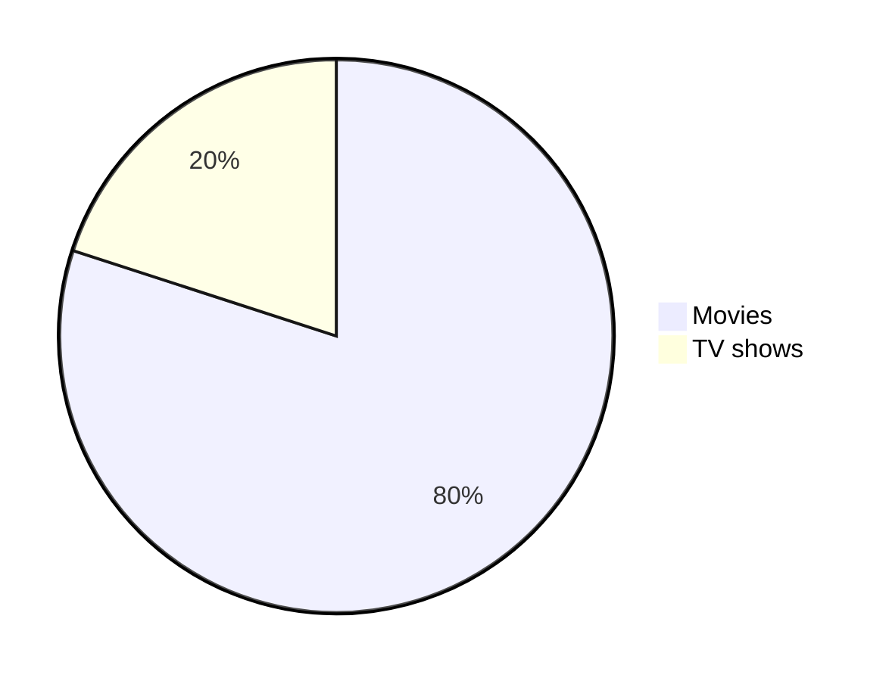

# Headings

```md
# Heading 1
## Heading 2
### Heading 3
#### Heading 4
##### Heading 5
###### Heading 6
```
<!-- omit in toc -->
# Heading 1
<!-- omit in toc -->
## Heading 2
<!-- omit in toc -->
### Heading 3
<!-- omit in toc -->
#### Heading 4
<!-- omit in toc -->
##### Heading 5
<!-- omit in toc -->
###### Heading 6

```md
<h1>Heading 1</h1>
<h2>Heading 2</h2>
<h3>Heading 3</h3>
<h4>Heading 4</h4>
<h5>Heading 5</h5>
<h6>Heading 6</h6>
```

<!-- omit in toc -->
<h1>Heading 1</h1>
<!-- omit in toc -->
<h2>Heading 2</h2>
<!-- omit in toc -->
<h3>Heading 3</h3>
<!-- omit in toc -->
<h4>Heading 4</h4>
<!-- omit in toc -->
<h5>Heading 5</h5>
<!-- omit in toc -->
<h6>Heading 6</h6>

```md
Heading 1
=
Heading 2
-
```

<!-- omit in toc -->
Heading 1 <!-- markdownlint-disable MD003 -->
=
<!-- omit in toc -->
Heading 2 <!-- markdownlint-disable MD003 -->
-

# Text styles

## Normal

```md
The quick brown fox jumps over the lazy dog.
```

The quick brown fox jumps over the lazy dog.

## Bold

Mac: <kbd>command+B</kbd>

Windows: <kbd>control+B</kbd>

```md
**The quick brown fox jumps over the lazy dog.**
__The quick brown fox jumps over the lazy dog.__
<strong>The quick brown fox jumps over the lazy dog.</strong>
```

**The quick brown fox jumps over the lazy dog.**

<!-- markdownlint-disable-next-line MD050 -->
__The quick brown fox jumps over the lazy dog.__

<strong>The quick brown fox jumps over the lazy dog.</strong>

## Italic

Mac: <kbd>command+I</kbd>

Windows: <kbd>control+I</kbd>

```md
*The quick brown fox jumps over the lazy dog.*
_The quick brown fox jumps over the lazy dog._
<em>The quick brown fox jumps over the lazy dog.</em>
```

*The quick brown fox jumps over the lazy dog.*

<!-- markdownlint-disable-next-line MD049 -->
_The quick brown fox jumps over the lazy dog._

<em>The quick brown fox jumps over the lazy dog.</em>

## Bold and Italic

```md
**_The quick brown fox jumps over the lazy dog._**
<strong><em>The quick brown fox jumps over the lazy dog.</em></strong>
```
<!-- markdownlint-disable-next-line MD049 -->
**_The quick brown fox jumps over the lazy dog._**

<strong><em>The quick brown fox jumps over the lazy dog.</em></strong>

## Blockquotes

Mac: <kbd>command+shift+.</kbd>

Windows: <kbd>control+shift+.</kbd>

```md
> The quick brown fox jumps over the lazy dog.

<br>

> The quick brown fox jumps over the lazy dog.
>
> The quick brown fox jumps over the lazy dog.
>
> The quick brown fox jumps over the lazy dog.

<br>

> The quick brown fox jumps over the lazy dog.
>> The quick brown fox jumps over the lazy dog.
>>> The quick brown fox jumps over the lazy dog.

<br>

> **The quick brown fox** *jumps over the lazy dog.*
```

> The quick brown fox jumps over the lazy dog.

<br>

> The quick brown fox jumps over the lazy dog.
>
> The quick brown fox jumps over the lazy dog.
>
> The quick brown fox jumps over the lazy dog.

<br>

> The quick brown fox jumps over the lazy dog.
>> The quick brown fox jumps over the lazy dog.
>>> The quick brown fox jumps over the lazy dog.

<br>

> **The quick brown fox** *jumps over the lazy dog.*

## Monospaced

```md
<samp>The quick brown fox jumps over the lazy dog.</samp>
```

<samp>The quick brown fox jumps over the lazy dog.</samp>

## Underlined

```md
<ins>The quick brown fox jumps over the lazy dog.</ins>
```

<ins>The quick brown fox jumps over the lazy dog.</ins>

## Strike-through

```md
~~The quick brown fox jumps over the lazy dog.~~
```

~~The quick brown fox jumps over the lazy dog.~~

```md
<pre>
Lorem ipsum dolor sit amet, consectetur adipiscing elit. <strike>Sed do eiusmod tempor incididunt ut labore et dolore magna
aliqua.</strike> Ut enim ad minim veniam, quis nostrud exercitation ullamco laboris nisi ut aliquip ex ea commodo consequat.
Duis aute irure dolor in reprehenderit in voluptate velit esse cillum dolore eu fugiat nulla pariatur. <strike>Excepteur sint
occaecat cupidatat non proident, sunt in culpa qui officia deserunt mollit anim id est laborum.</strike>
</pre>
```

<pre>
Lorem ipsum dolor sit amet, consectetur adipiscing elit. <strike>Sed do eiusmod tempor incididunt ut labore et dolore magna
aliqua.</strike> Ut enim ad minim veniam, quis nostrud exercitation ullamco laboris nisi ut aliquip ex ea commodo consequat.
Duis aute irure dolor in reprehenderit in voluptate velit esse cillum dolore eu fugiat nulla pariatur. <strike>Excepteur sint
occaecat cupidatat non proident, sunt in culpa qui officia deserunt mollit anim id est laborum.</strike>
</pre>

````md
<strike>

```js
console.log('Error');
```

</strike>
````

<strike>

```js
console.log('Error');
```

</strike>

## Boxed

```md
<table><tr><td>The quick brown fox jumps over the lazy dog.</td></tr></table>
```

<table><tr><td>The quick brown fox jumps over the lazy dog.</td></tr></table>

## Subscript

```md
log<sub>2</sub>(x)
Subscript <sub>The quick brown fox jumps over the lazy dog.</sub>
```

log<sub>2</sub>(x)

Subscript <sub>The quick brown fox jumps over the lazy dog.</sub>

## Superscript

```md
2 <sup>53-1</sup> and -2 <sup>53-1</sup>
Superscript <sup>The quick brown fox jumps over the lazy dog.</sup>
```

2 <sup>53-1</sup> and -2 <sup>53-1</sup>

Superscript <sup>The quick brown fox jumps over the lazy dog.</sup>

## Text Color

Using [MathJax](#mathematical-expressions-19-july-2022) syntax:

| Color Name      | Code                                                                                         | Example                                                        |
|-----------------|----------------------------------------------------------------------------------------------|----------------------------------------------------------------|
| Apricot         | `$\color{Apricot}{The\ quick\ brown\ fox\ jumps\ over\ the\ lazy\ dog.}$`                    | $\color{Apricot}{The\ quick\ brown\ fox\ jumps\ over\ the\ lazy\ dog.}$      |
| Aquamarine      | `$\color{Aquamarine}{The\ quick\ brown\ fox\ jumps\ over\ the\ lazy\ dog.}$`                 | $\color{Aquamarine}{The\ quick\ brown\ fox\ jumps\ over\ the\ lazy\ dog.}$   |
| Bittersweet     | `$\color{Bittersweet}{The\ quick\ brown\ fox\ jumps\ over\ the\ lazy\ dog.}$`                | $\color{Bittersweet}{The\ quick\ brown\ fox\ jumps\ over\ the\ lazy\ dog.}$  |
| Black           | `$\color{Black}{The\ quick\ brown\ fox\ jumps\ over\ the\ lazy\ dog.}$`                      | $\color{Black}{The\ quick\ brown\ fox\ jumps\ over\ the\ lazy\ dog.}$        |

[Full Table](./MathJax.md)

## Multiline

The quick\
brown fox\
jumps over\
the lazy dog.

```md
The quick\
brown fox\
jumps over\
the lazy dog.
```

# Syntax Highlighting

## Inline code

A class method is an instance method of the class object. When a new class is created, an object of type `Class` is initialized and assigned to a global constant (Mobile in this case).

You can use <kbd>command + e </kbd> on Mac or <kbd>control + e</kbd> on Windows to insert inline code.

## Code block

<!-- markdownlint-disable MD040 -->

```
public static String monthNames[] = {"January", "February", "March", "April", "May", "June", "July", "August", "September", "October", "November", "December"};
```

<!-- markdownlint-enable MD040 -->

````md
```
public static String monthNames[] = {"January", "February", "March", "April", "May", "June", "July", "August", "September", "October", "November", "December"};
```
````

```java
public static String monthNames[] = {"January", "February", "March", "April", "May", "June", "July", "August", "September", "October", "November", "December"};
```

````md
```java
public static String monthNames[] = {"January", "February", "March", "April", "May", "June", "July", "August", "September", "October", "November", "December"};
```
````

Refer to [this](https://github.com/github-linguist/linguist/blob/master/lib/linguist/languages.yml) and [this](https://github.com/github-linguist/linguist/tree/master/vendor) GitHub document to find all the valid keywords.

## Diff Code block

```diff
## git diff a/test.txt b/test.txt
diff --git a/a/test.txt b/b/test.txt
index 309ee57..c995021 100644
--- a/a/test.txt
+++ b/b/test.txt
@@ -1,8 +1,6 @@
-The quick brown fox jumps over the lazy dog
+The quick brown fox jumps over the lazy cat

 a
-b
 c
 d
-e
 f
```

````md
```diff
## git diff a/test.txt b/test.txt
diff --git a/a/test.txt b/b/test.txt
index 309ee57..c995021 100644
--- a/a/test.txt
+++ b/b/test.txt
@@ -1,8 +1,6 @@
-The quick brown fox jumps over the lazy dog
+The quick brown fox jumps over the lazy cat

 a
-b
 c
 d
-e
 f
```
````

```diff
- Text in Red
+ Text in Green
! Text in Orange
# Text in Gray
@@ Text in Purple and bold @@
```

````md
```diff
- Text in Red
+ Text in Green
! Text in Orange
# Text in Gray
@@ Text in Purple and bold @@
```
````

# Alignments

```md
<p align="left">

</p>
```

<p align="left">
<!-- markdownlint-disable-next-line MD013 -->

</p>

```md
<p align="center">

</p>
```

<p align="center">
<!-- markdownlint-disable-next-line MD013 -->

</p>

```md
<p align="right">

</p>
```

<p align="right">
<!-- markdownlint-disable-next-line MD013 -->

</p>

```md
<h3 align="center"> My latest Medium posts </h3>
```

<!-- omit in toc -->
<h3 align="center"> My latest Medium posts </h3>

# Tables

```md
<table>
<tr>
<td width="33%"">
The quick brown fox jumps over the lazy dog.
</td>
<td width="33%">
The quick brown fox jumps over the lazy dog.
</td>
<td width="33%">
The quick brown fox jumps over the lazy dog.
</td>
</tr>
</table>
```

<table>
<tr>
<td width="33%"">
The quick brown fox jumps over the lazy dog.
</td>
<td width="33%">
The quick brown fox jumps over the lazy dog.
</td>
<td width="33%">
The quick brown fox jumps over the lazy dog.
</td>
</tr>
</table>

```md
| Default | Left align | Center align | Right align |
| - | :- | :-: | -: |
| 9999999999 | 9999999999 | 9999999999 | 9999999999 |
| 999999999 | 999999999 | 999999999 | 999999999 |
| 99999999 | 99999999 | 99999999 | 99999999 |
| 9999999 | 9999999 | 9999999 | 9999999 |

| Default    | Left align | Center align | Right align |
| ---------- | :--------- | :----------: | ----------: |
| 9999999999 | 9999999999 | 9999999999   | 9999999999  |
| 999999999  | 999999999  | 999999999    | 999999999   |
| 99999999   | 99999999   | 99999999     | 99999999    |
| 9999999    | 9999999    | 9999999      | 9999999     |

Default    | Left align | Center align | Right align
---------- | :--------- | :----------: | ----------:
9999999999 | 9999999999 | 9999999999   | 9999999999
999999999  | 999999999  | 999999999    | 999999999
99999999   | 99999999   | 99999999     | 99999999
9999999    | 9999999    | 9999999      | 9999999
```

| Default | Left align | Center align | Right align |
| - | :- | :-: | -: |
| 9999999999 | 9999999999 | 9999999999 | 9999999999 |
| 999999999 | 999999999 | 999999999 | 999999999 |
| 99999999 | 99999999 | 99999999 | 99999999 |
| 9999999 | 9999999 | 9999999 | 9999999 |

| Default    | Left align | Center align | Right align |
| ---------- | :--------- | :----------: | ----------: |
| 9999999999 | 9999999999 | 9999999999   | 9999999999  |
| 999999999  | 999999999  | 999999999    | 999999999   |
| 99999999   | 99999999   | 99999999     | 99999999    |
| 9999999    | 9999999    | 9999999      | 9999999     |

<!-- markdownlint-disable MD055 -->
Default    | Left align | Center align | Right align
---------- | :--------- | :----------: | ----------:
9999999999 | 9999999999 | 9999999999   | 9999999999
999999999  | 999999999  | 999999999    | 999999999
99999999   | 99999999   | 99999999     | 99999999
9999999    | 9999999    | 9999999      | 9999999
<!-- markdownlint-enable MD055 -->

```md
<table>
<tr>
<th>Heading 1</th>
<th>Heading 2</th>
</tr>
<tr>

<td>

| A | B | C |
|--|--|--|
| 1 | 2 | 3 |

</td><td>

| A | B | C |
|--|--|--|
| 1 | 2 | 3 |

</td></tr> </table>
```

<table>
<tr>
<th>Heading 1</th>
<th>Heading 2</th>
</tr>
<tr>

<td>

| A | B | C |
|--|--|--|
| 1 | 2 | 3 |

</td><td>

| A | B | C |
|--|--|--|
| 1 | 2 | 3 |

</td></tr> </table>

```md
| A | B | C |
|---|---|---|
| 1 | 2 | 3 <br/> 4 <br/> 5 |
```

| A | B | C |
|---|---|---|
| 1 | 2 | 3 <br/> 4 <br/> 5 |

```md
<table>
<tr>
<th>Before Hoisting</th>
<th>After Hoisting</th>
</tr>
<tr>
<td>
<pre lang="js">
console.log(fullName); // undefined
fullName = "Dariana Trahan";
console.log(fullName); // Dariana Trahan
var fullName;
</pre>
</td>
<td>
<pre lang="js">
var fullName;
console.log(fullName); // undefined
fullName = "Dariana Trahan";
console.log(fullName); // Dariana Trahan
</pre>
</td>
</tr>
</table>
```

<table>
<tr>
<th>Before Hoisting</th>
<th>After Hoisting</th>
</tr>
<tr>
<td>
<pre lang="js">
console.log(fullName); // undefined
fullName = "Dariana Trahan";
console.log(fullName); // Dariana Trahan
var fullName;
</pre>
</td>
<td>
<pre lang="js">
var fullName;
console.log(fullName); // undefined
fullName = "Dariana Trahan";
console.log(fullName); // Dariana Trahan
</pre>
</td>
</tr>
</table>

# Links

## Inline

```md
[The-Ultimate-Markdown-Cheat-Sheet](https://github.com/lifeparticle/Markdown-Cheatsheet)
```

[The-Ultimate-Markdown-Cheat-Sheet](https://github.com/lifeparticle/The-Ultimate-Markdown-Cheat-Sheet)

## Reference

```md
[The-Ultimate-Markdown-Cheat-Sheet][reference text]

[The-Ultimate-Markdown-Cheat-Sheet][1]

[Markdown-Cheat-Sheet]

[reference text]: https://github.com/lifeparticle/Markdown-Cheatsheet
[1]: https://github.com/lifeparticle/Markdown-Cheatsheet
[Markdown-Cheat-Sheet]: https://github.com/lifeparticle/Markdown-Cheatsheet
```

[The-Ultimate-Markdown-Cheat-Sheet][reference text]

[The-Ultimate-Markdown-Cheat-Sheet][1]

[Markdown-Cheat-Sheet]

[reference text]: https://github.com/lifeparticle/The-Ultimate-Markdown-Cheat-Sheet
[1]: https://github.com/lifeparticle/The-Ultimate-Markdown-Cheat-Sheet
[Markdown-Cheat-Sheet]: https://github.com/lifeparticle/The-Ultimate-Markdown-Cheat-Sheet

## Footnote

Footnote.[^1]

Some other important footnote.[^2]

[^1]: This is footnote number one.
[^2]: Here is the second footnote.

```md
Footnote.[^1]

Some other important footnote.[^2]

[^1]: This is footnote number one.
[^2]: Here is the second footnote.
```


## Relative

```md
[Example of a relative link](rl.md)
```

[Example of a relative link](rl.md)

## Auto

```md
Visit https://github.com/
```

Visit https://github.com/

```md
Email at example@example.com
```

Email at example@example.com

## Section


## Hover

You can use [BinaryTree](https://binarytree.dev/ "Array of Developer Productivity Tools Designed to Help You Save Time") to create markdown tables.

<!-- markdownlint-disable MD051 -->
You can use [BinaryTree](## "Array of Developer Productivity Tools Designed to Help You Save Time") to create markdown tables.

## Enclosed

```md
<https://github.com/>
```

<https://github.com/>

## Highlight words and link it to a URL

```md
[BinaryTree](https://binarytree.dev/)
```

[BinaryTree](https://binarytree.dev/)


# Images

Alt text and title are optional.

```md

```


```md
![alt text][image]

[image]: https://images.unsplash.com/photo-1415604934674-561df9abf539?ixlib=rb-1.2.1&ixid=eyJhcHBfaWQiOjEyMDd9&auto=format&fit=crop&w=100&q=80 "Title text"
```

![alt text][image]

[image]: https://images.unsplash.com/photo-1415604934674-561df9abf539?ixlib=rb-1.2.1&ixid=eyJhcHBfaWQiOjEyMDd9&auto=format&fit=crop&w=100&q=80 "Title text"

```md

```

<!-- markdownlint-disable-next-line MD013 -->


```md

```


```md

```

[](https://binarytree.dev/)

```md
[](https://binarytree.dev/)
```

<!-- markdownlint-disable-next-line MD013 -->
<a href='https://binarytree.dev/' target='_blank'>  </a>

```md
<a href='https://binarytree.dev/' target='_blank'>  </a>
```

## Theme

### Using picture tag

The HTML `<picture>` element, along with the `prefers-color-scheme` media feature, enables you to dynamically adjust images according to the user's color scheme preference, providing options for both light and dark modes.

For example, the code snippet below demonstrates how to display a dark-themed BinaryTree logo when the user's device is set to a dark mode, and a light-themed BinaryTree logo for light mode settings:

```md
<picture>
  <source media="(prefers-color-scheme: dark)" srcset="https://github.com/lifeparticle/lifeparticle/blob/master/gh_social_dark.png">
  <source media="(prefers-color-scheme: light)" srcset="https://github.com/lifeparticle/lifeparticle/blob/master/gh_social_light.png">
  
</picture>
```

<picture>
  <source media="(prefers-color-scheme: dark)" srcset="https://github.com/lifeparticle/lifeparticle/blob/master/gh_social_dark.png">
  <source media="(prefers-color-scheme: light)" srcset="https://github.com/lifeparticle/lifeparticle/blob/master/gh_social_light.png">
  
</picture>

### Using dark and light mode

```md
[![Badge][Logo-dark]](https://binarytree.dev#gh-dark-mode-only)
[![Badge][Logo-light]](https://binarytree.dev#gh-light-mode-only)

[Logo-dark]: https://github-readme-stats.vercel.app/api?username=lifeparticle&theme=graywhite&show_icons=true#gh-light-mode-only
[Logo-light]: https://github-readme-stats.vercel.app/api?username=lifeparticle&theme=dark&show_icons=true#gh-dark-mode-only
```

[![Badge][Logo-dark]](https://binarytree.dev#gh-dark-mode-only)
[![Badge][Logo-light]](https://binarytree.dev#gh-light-mode-only)

[Logo-light]: https://github-readme-stats.vercel.app/api?username=lifeparticle&theme=graywhite&show_icons=true#gh-light-mode-only
[Logo-dark]: https://github-readme-stats.vercel.app/api?username=lifeparticle&theme=dark&show_icons=true#gh-dark-mode-only

```md
<a href="https://github.com/anuraghazra/github-readme-stats#gh-light-mode-only">
  
</a>
<a href="https://github.com/anuraghazra/github-readme-stats#gh-dark-mode-only">
  
</a>
```

<a href="https://github.com/anuraghazra/github-readme-stats#gh-light-mode-only">
  
</a>
<a href="https://github.com/anuraghazra/github-readme-stats#gh-dark-mode-only">
  
</a>

# Badges

```md

```


# Lists

## Ordered

Mac: <kbd>command+shift+7</kbd>

Windows: <kbd>control+shift+7</kbd>

```md
1. One
2. Two
3. Three
```

1. One
2. Two
3. Three

```md
1. First level
    1. Second level
        - Third level
            - Fourth level
2. First level
    1. Second level
3. First level
    1. Second level
```

1. First level
    1. Second level
        - Third level
            - Fourth level
2. First level
    1. Second level
3. First level
    1. Second level

## Unordered

Mac: <kbd>command+shift+8</kbd>

Windows: <kbd>control+shift+8</kbd>

```md
* 1
* 2
* 3

+ 1
+ 2
+ 3


- 1
- 2
- 3
```

<!-- markdownlint-disable MD004 -->

* 1
* 2
* 3

+ 1
+ 2
+ 3

<!-- markdownlint-enable MD004 -->

- 1
- 2
- 3

```md
- First level
  - Second level
    - Third level
      - Fourth level
- First level
  - Second level
- First level
  - Second level
```

- First level
  - Second level
    - Third level
      - Fourth level
- First level
  - Second level
- First level
  - Second level

```md
<ul>
<li>First item</li>
<li>Second item</li>
<li>Third item</li>
<li>Fourth item</li>
</ul>
```

<ul>
<li>First item</li>
<li>Second item</li>
<li>Third item</li>
<li>Fourth item</li>
</ul>

## Task

```md
- [x] Fix Bug 223
- [ ] Add Feature 33
- [ ] Add unit tests
```

- [x] Fix Bug 223
- [ ] Add Feature 33
- [ ] Add unit tests

# Buttons

```md
<kbd>cmd + shift + p</kbd>
```

<kbd>cmd + shift + p</kbd>

```md
<kbd> <br> cmd + shift + p <br> </kbd>
```

<kbd> <br> cmd + shift + p <br> </kbd>

```md
<kbd>[Markdown-Cheatsheet](https://github.com/lifeparticle/Markdown-Cheatsheet)</kbd>
```

<kbd>[Markdown-Cheatsheet](https://github.com/lifeparticle/Markdown-Cheatsheet)</kbd>

```md
[<kbd>Markdown-Cheatsheet</kbd>](https://github.com/lifeparticle/Markdown-Cheatsheet)
```

[<kbd>Markdown-Cheatsheet</kbd>](https://github.com/lifeparticle/Markdown-Cheatsheet)

## Button with emoji

<!-- markdownlint-disable-next-line MD013 -->
<kbd> <br> [Markdown-Cheatsheet](https://github.com/lifeparticle/Markdown-Cheatsheet) ↗️ <br> </kbd>

```md
<kbd> <br> [Markdown-Cheatsheet](https://github.com/lifeparticle/Markdown-Cheatsheet) <br> </kbd>
```

# Collapsible items (28 July 2023)

```md
<details>
  <summary>Markdown</summary>

-  <kbd>[Markdown Editor](https://binarytree.dev/me)</kbd>
-  <kbd>[Table Of Content](https://binarytree.dev/toc)</kbd>
-  <kbd>[Markdown Table Generator](https://binarytree.dev/md_table_generator)</kbd>

</details>
```

<details>
  <summary>Markdown</summary>

- <kbd>[Markdown Editor](https://binarytree.dev/me)</kbd>
- <kbd>[Table Of Content](https://binarytree.dev/toc)</kbd>
- <kbd>[Markdown Table Generator](https://binarytree.dev/md_table_generator)</kbd>

</details>

# Horizontal Rule

```md
---
***
___
```

---

<!-- markdownlint-disable-next-line MD035 -->
***

<!-- markdownlint-disable-next-line MD035 -->
___

# Diagrams (19 July 2022)

````md

````


# Mathematical expressions (19 July 2022)

> [!IMPORTANT]
> Check out the official documentation on [GitHub](https://docs.github.com/en/get-started/writing-on-github/working-with-advanced-formatting/writing-mathematical-expressions) to learn more about writing and formatting MathJax syntax.

```md
This is an inline math expression $x = {-b \pm \sqrt{b^2-4ac} \over 2a}$
```

This is an inline math expression $x = {-b \pm \sqrt{b^2-4ac} \over 2a}$

```md
$$
x = {-b \pm \sqrt{b^2-4ac} \over 2a}
$$
```

$$
x = {-b \pm \sqrt{b^2-4ac} \over 2a}
$$

# Alerts (8 January 2024)

```md
> [!NOTE]
> Essential details that users should not overlook, even when browsing quickly.

<br>

> [!TIP]
> Additional advice to aid users in achieving better outcomes.

<br>

> [!IMPORTANT]
> Vital information required for users to attain success.

<br>

> [!WARNING]
> Urgent content that requires immediate user focus due to possible risks.

<br>

> [!CAUTION]
> Possible negative outcomes resulting from an action.
```

> [!NOTE]
> Essential details that users should not overlook, even when browsing quickly.

<br>

> [!TIP]
> Additional advice to aid users in achieving better outcomes.

<br>

> [!IMPORTANT]
> Vital information required for users to attain success.

<br>

> [!WARNING]
> Urgent content that requires immediate user focus due to possible risks.

<br>

> [!CAUTION]
> Possible negative outcomes resulting from an action.

# Mention people and teams

In issues:

```md
@lifeparticle
```

[Example](https://github.com/lifeparticle/Markdown-Cheatsheet/issues/1)

# Reference issues and pull requests

In issues:

```md
#1
#10
```

[Example](https://github.com/lifeparticle/Markdown-Cheatsheet/issues/1)

In markdown file:

```md
https://github.com/lifeparticle/Markdown-Cheatsheet/issues/1
https://github.com/lifeparticle/Markdown-Cheatsheet/pull/10
```

https://github.com/lifeparticle/Markdown-Cheatsheet/issues/1

https://github.com/lifeparticle/Markdown-Cheatsheet/pull/10

# Color models

```md
`#ffffff`
`#000000`
```

[Example](https://github.com/lifeparticle/Markdown-Cheatsheet/issues/1)

# View Code

Click either the Code (top right) or Raw (top left) option to see the markdown code.


> [!NOTE]
> Make sure you have clicked the markdown file to see the above view.


# Code in titles

In issue, and pull request titles.

`TEST` ISSUE

```md

`TEST` ISSUE

```


# Reference Labels

Labels referenced by URLs in Markdown are now automatically rendered.

https://github.com/lifeparticle/Markdown-Cheatsheet/labels/documentation

```md
https://github.com/lifeparticle/Markdown-Cheatsheet/labels/documentation
```

# Miscellaneous

## Comments

<!--
Lorem ipsum dolor sit amet
-->

# watchlist

[Fire and Ice 1983](https://archive.org/details/a137ee3e2a37701695abd791d95bfeaf-1080p)
<video controls width="100%" height="auto" poster="https://cover.box3.net/newsimg/dvdmov/max1126915764-frontback-cover.jpg">

  <source src="https://archive.org/download/a137ee3e2a37701695abd791d95bfeaf-1080p/a137ee3e2a37701695abd791d95bfeaf-1080p.mp4" type="video/mp4" />

  <source src="https://archive.org/download/a137ee3e2a37701695abd791d95bfeaf-1080p/a137ee3e2a37701695abd791d95bfeaf-1080p.mp4" type="video/mp4" />

  Download the
  or
  <a href="https://archive.org/download/a137ee3e2a37701695abd791d95bfeaf-1080p/a137ee3e2a37701695abd791d95bfeaf-1080p.mp4">MP4</a>
  video.
</video>


  [Normani Wants You To Expect the Unexpected](https://www.wmagazine.com/culture/normani-new-music-album-interview) [Normani Prefers This $100 vs. $700 Purse ](https://www.youtube.com/watch?v=7nfovVLjnr4) [Fifth Harmony Made Their First Red Carpet Appearance as a Foursome and Looked Fierce AF](https://www.cosmopolitan.com/style-beauty/fashion/a8616047/fifth-harmony-first-red-carpet-appearance-performance-as-foursome/)

--- 


[This original satellite photo was used by JPL imaging scientists to create "L.A.: The Movie," ](https://landsat.visibleearth.nasa.gov/view.php?id=52470)
[List Of Dams](https://x.com/thakasartu/status/1789384568002453589) [nASA stI pROGRAM](https://www.youtube.com/@NASASTIProgram)
[los angeles](https://eoimages.gsfc.nasa.gov/images/imagerecords/149000/149458/losangeles_oli2_2022038_lrg.jpg) [A Super View of LA](https://earthobservatory.nasa.gov/images/149458/a-super-view-of-la#:~:text=NASA%20launched%20Landsat%209%20in,subsystems%20and%20calibrating%20its%20instruments.) [Early Landsat View of Los Angeles and Vicinity](https://www.jpl.nasa.gov/images/pia02988-early-landsat-view-of-los-angeles-and-vicinity) [Zoom Down to Los Angeles, CA](https://svs.gsfc.nasa.gov/1214)


---

# HElp im Active Mission Nasa Mars


<div class="twoPanelSpread">
  <div class="row">
    <div class="panelColumn">
      <div class="leftColumn">
<a href="https://science.nasa.gov/mission/mars-reconnaissance-orbiter/"><h3>Mars Reconnaissance Orbiter</h3></a>
        </div>
    </div>
    <div class="panelColumn">
      <div class="rightColumn">

<a href="https://ricothaka.github.io/cv/"><h3>Rashard Iman Kelly NasaJPL M_R_O Active</h3></a>
         </div>
    </div>
  </div>
</div>

<iframe width="100%" height="300" scrolling="no" frameborder="no" allow="autoplay" src="https://w.soundcloud.com/player/?url=https%3A//api.soundcloud.com/tracks/156920432&color=%23ff5500&auto_play=false&hide_related=false&show_comments=true&show_user=true&show_reposts=false&show_teaser=true&visual=true"></iframe><div style="font-size: 10px; color: #cccccc;line-break: anywhere;word-break: normal;overflow: hidden;white-space: nowrap;text-overflow: ellipsis; font-family: Interstate,Lucida Grande,Lucida Sans Unicode,Lucida Sans,Garuda,Verdana,Tahoma,sans-serif;font-weight: 100;"><a href="https://soundcloud.com/home-2001" title="HOME" target="_blank" style="color: #cccccc; text-decoration: none;">HOME</a> · <a href="https://soundcloud.com/home-2001/oort-cloud" title="Oort Cloud" target="_blank" style="color: #cccccc; text-decoration: none;">Oort Cloud</a></div>

[Future-Space Cadets Prod By Zaytoven](https://youtu.be/sYeHfBQktec?si=YPx9gkE1m9veEqTL) 

## Dominion Tank Police (Acts I and II) [English Dubbed] (1997 Manga Entertainment Home Video Master) [Betacam SP Transfer.mp4

<video controls width="100%" height="auto" poster="https://theglorioblog.com/wp-content/uploads/2018/02/vlcsnap-2017-05-02-20h28m27s332.png">

  <source src="https://archive.org/download/dominion-tank-police-english-dubbed-master/Dominion%20Tank%20Police%20%28Acts%20I%20and%20II%29%20%5BEnglish%20Dubbed%5D%20%281997%20Manga%20Entertainment%20Home%20Video%20Master%29%20%5BBetacam%20SP%20Transfer.mp4" type="video/mp4" />

  <source src="https://archive.org/download/dominion-tank-police-english-dubbed-master/Dominion%20Tank%20Police%20%28Acts%20I%20and%20II%29%20%5BEnglish%20Dubbed%5D%20%281997%20Manga%20Entertainment%20Home%20Video%20Master%29%20%5BBetacam%20SP%20Transfer.mp4" type="video/mp4" />

  Download the
  or
  <a href="https://archive.org/download/dominion-tank-police-english-dubbed-master/Dominion%20Tank%20Police%20%28Acts%20I%20and%20II%29%20%5BEnglish%20Dubbed%5D%20%281997%20Manga%20Entertainment%20Home%20Video%20Master%29%20%5BBetacam%20SP%20Transfer.mp4">MP4</a>
  video.
</video>

[Pilgrimage to Mecha 08: Dominion Tank Police (OVA)](https://theglorioblog.com/2017/05/05/pilgrimage-to-mecha-08-dominion-tank-police/)

[](https://media.defcon.org/DEF%20CON%2029/DEF%20CON%2029%20video%20and%20slides/DEF%20CON%2029%20-%20Agent%20X%20-%20A%20Look%20Inside%20Security%20at%20the%20New%20York%20Times.mp4)


[](https://media.defcon.org/DEF%20CON%2029/DEF%20CON%2029%20video%20and%20slides/DEF%20CON%2029%20-%20Agent%20X%20-%20A%20Look%20Inside%20Security%20at%20the%20New%20York%20Times.mp4)


 [Roll Out - Ludacris](https://www.youtube.com/watch?v=3ArhZPYplFk) [Kash Doll - "Hustla"](https://www.youtube.com/watch?v=2Ii85xGRoPw) [KAshdoll -Rich Hoochie](https://youtu.be/gfyF2RqNTBI?si=UmnM4xP6fOk5T88V) [Kash Doll - For Everybody](https://youtu.be/tQ8xAeVp9qQ?si=YqEkwXd_cZRZc74r) [GloRilla - Yeah Glo!](https://www.youtube.com/watch?v=voT9hOs6FZc) [GloRilla - TGIF](https://youtu.be/zP6eqCOM7tk) [Moneybagg Yo feat. GloRilla - On Wat U On](https://www.youtube.com/watch?v=DMaZ_hRAu0A) [Moneybagg Yo - Wockesha (Official Music Video)](https://youtu.be/6bN45f9NjlA?si=lQE9D3pt-aNeFRRe) [Three 6 Mafia - Poppin' My Collar](https://youtu.be/2klTw123_jw?si=G9bVSscLsOXCGf6x) [Three 6 Mafia - That's Right (Feat. Akon)](https://www.youtube.com/watch?v=WWuyIN1YJY4) [Rich Homie Quan - Type of Way](https://www.youtube.com/watch?v=-KKbdErJkiY)

## (ﾉ◕ヮ◕)ﾉ*:・ﾟ✧ ♫♪.ılılıll|̲̅̅●̲̅̅|̲̅̅=̲̅̅|̲̅̅●̲̅̅|llılılı.♫♪
Normani, Hi I am getting my thoughts together after a lot of Architechture and infrastructure Research. If you Remember Jeff at RentPath he talked about the problem too. We Need [Water for launches](https://www.theguardian.com/global/video/2018/oct/24/nasa-cools-rocket-launch-pad-with-2m-litre-flood-of-water-video) and private corps moved the water supply and thats why la is a Desert. So im still having issues at LA PUblic with not being able to listen to music. It a really difficult thing to deal with bc i still prime my day with whatever im in the mood. Its like when Coral was around... I remember i told her abt you traveling and that i really dont know, who u are, and if u will be good to us. This playlist will rumble the freeway... PPL outside NY really dont know how to listen to the music, [Philly do that shit right](https://youtu.be/xIVuaS08C3c?si=AAAy9gk1jW4h2dIV), and i dont know [chicago](https://youtu.be/TVQv8Bh-RFY?si=mKNAjjKlWmAyh6vO) Erika would freak out about me listening to Jay Z. I think his imposter raped her.. I cant put the story together at all and i dont want it to [bite us in the ass at a piknik](https://www.youtube.com/watch?v=j5qnLw9JJwA).. I have to say that the Los Angeles tourist are enjoying playing music outloud. Thats Old Los Angeles Culture we grew up on in savannah and they be sending messages after they see yall dancing in the club 
[Jay-Z - Things That U Do (Feat. Mariah Carey)](https://youtu.be/XRxItoK6wKc?si=_7LvBtKB8-wuzTzA) [JAY-Z - Anything](https://youtu.be/odThhIA2gUM?si=ssS76gc4Xhd_YKTt) [JAY-Z - On To The Next One ft. Swizz Beatz](https://www.youtube.com/watch?v=VTYXVwrWz4Y) [Jay-Z - Intro / A Million & One Questions](https://youtu.be/Qn3XxrjGbWI?si=3GBVJtlqEwZ_QcxT) [Coming Of Age - JayZ MemphisBleek](https://www.youtube.com/watch?v=3HjubPJ-Xjk) [Brooklyn's Finest - JayZ](https://www.youtube.com/watch?v=gwbUtfEJ8lE) [Jay - Z Girls, Girls, Girls](https://youtu.be/Evpc2pRHX9I?si=SvrwoKMAV-JcEEEJ)[Jay-Z - Smile (Feat. Gloria Carter)](https://youtu.be/U-csUZICf4k?si=5f3BlyxLF0om1Qc5) [Renegade - JayZ](https://www.youtube.com/watch?v=zUSTrXxJLJQ) [Heart Of The City (Ain't No Love) Jay-Z](https://www.youtube.com/watch?v=Cn4alua9o2o) [JayZ - Song Cry](https://youtu.be/LBFBMTq0334?si=AA-y98OAsrRY_MX3) [Heart Of The City (Ain't No Love) (Live On MTV Unplugged / 2001)](https://youtu.be/uzWb0oVp2J8?si=7qigLi4Rh74zcOhL) [Song Cry (Live On MTV Unplugged / 2001)](https://www.youtube.com/watch?v=pYI6bSq6a2Y) [Ruff Ryders(feat. Jay-Z) - Jigga my nigga](https://youtu.be/yr1gvbKibTU?si=Ba29-igcPLup0c1w)
<iframe width="912" height="513" src="https://www.youtube.com/embed/lEMLhZrZs5U" title="Jay Z: Hard Knock Life (EXPLICIT) [UP.S 1080] (1998)" frameborder="0" allow="accelerometer; autoplay; clipboard-write; encrypted-media; gyroscope; picture-in-picture; web-share" referrerpolicy="strict-origin-when-cross-origin" allowfullscreen></iframe>


 


<a href="https://upload.wikimedia.org/wikipedia/en/9/90/X-Men_COTA_arcade_flyer.jpg">

## X-Men - Children Of The Atom (950105 usa)
X-Men: Children of the Atom (Japanese: エックス・メン　チルドレン　オブ　ジ　アトム, Hepburn: Ekkusu Men Chirudoren obu ji Atomu) is an arcade game that was produced by Capcom and released on the CP System II arcade hardware in 1994 in Japan and in 1995 in North America and Europe.

Based on the X-Men comic book, it is the first fighting game produced by Capcom using characters under license from Marvel Comics. Released around the time of the mid-1990s X-Men animated series, the game features voice actors from the series reprising their roles. The game's plot is based on the "Fatal Attractions" story from the comics – players control one of the X-Men or their enemies in their fight against the villain Magneto. They face each of the other characters in the game in best of three one-on-one fighting matches, before battling Juggernaut and Magneto.

The gameplay has much in common with Capcom's previous fighting games, Super Street Fighter II Turbo and Darkstalkers. Children of the Atom adds a combo system that features long combos that can even be performed in mid-air. Also featured in the game are various tactical maneuvers, including the ability for characters to roll. Children of the Atom introduced multi-tiered fighting environments in which the ground would crumble and characters would fall into lower parts of the level. These concepts and the fast pace of the game would provide the basis for Capcom's Marvel vs. Capcom series, which started with the game's successor X-Men vs. Street Fighter.

Ports of the game were released for Sega Saturn, PlayStation and personal computer. Of these, the PlayStation version was not as well received as the other versions, suffering from slowdown and missing frames of animation. [ReadMoreOnWikiPedia](https://en.wikipedia.org/wiki/X-Men:_Children_of_the_Atom_%28video_game%29)
[SaveState](ricothaka.github.io/xmcotau.save)
[PlayHere](https://www.retrogames.cc/arcade-games/x-men-children-of-the-atom-950105-usa.html#)

 <div class="mro_banner">
  
  <div class="innertext-block">
    <h4>Los Angeles</h4>
    <p>hole to another universe</p>
  </div>
</div>   


[sonic](https://www.reddit.com/r/SonicTheHedgehog/comments/uoah0j/found_this_at_an_arcade_anyone_recognize_it_is_it/?rdt=33582)
<iframe src="https://archive.org/embed/arcade_sonic" width="560" height="384" frameborder="0" webkitallowfullscreen="true" mozallowfullscreen="true" allowfullscreen></iframe>
<div class="oncall">
            <div></div>
            <div></div>
            <div></div>
            <div></div>
            <div></div>
          </div>


<div class="swatch">
            <div></div>
            <div></div>
            <div></div>
            <div></div>
            <div></div>
          </div>


<div class="gullies">
            <div></div>
            <div></div>
            <div></div>
            <div></div>
            <div></div>
          </div>
<div class="latto">
            <div></div>
            <div></div>
            <div></div>
            <div></div>
            <div></div>
          </div>


 
<div class="normani">
    <div></div>
    <div></div>
    <div></div>
    <div></div>
    </div>

<div class='twoPanelSpread'>
  <div class='row'>
    <div class='panelColumn'>
      <div class='leftColumn'>
        
      </div>
    </div>
    <div class='panelColumn'>
      <div class='rightColumn'>
        

  </div>
  </div>
  </div>
</div>


[](https://github.com/pages-themes/hacker/actions/workflows/ci.yaml)

<hr />

<div class="swatch">
    <div></div>
    <div></div>
    <div></div>
    <div></div>
    <div></div>
    <div></div>
    <div></div>
    <div></div>
    <div></div>
    <div></div>
    <div></div>
    <div></div>
    <div></div>
    <div></div>
    <div></div>
    <div></div>
    <div></div>
    <div></div>
    <div></div>
    <div></div>
    <div></div>
    <div></div>
    <div></div>
    <div></div>
    <div></div>
    <div></div>
    <div></div>
    <div></div>
    <div></div>
    <div></div>
    <div></div>
    <div></div>
    <div></div>
    <div></div>
    <div></div>
    <div></div>
    <div></div>
    <div></div>
    <div></div>
    <div></div>
    <div></div>
    <div></div>
    <div></div>
    <div></div>
    <div></div>
    <div></div>
    <div></div>
    <div></div>
    <div></div>
    <div></div>
    <div></div>
    <div></div>
    <div></div>
    <div></div>
    <div></div>
    <div></div>
    <div></div>
    <div></div>
    <div></div>
    <div></div>
    <div></div>
    <div></div>
    <div></div>
    <div></div>
    <div></div>
    <div></div>
    <div></div>
    <div></div>
    <div></div>
    <div></div>
    <div></div>
    <div></div>
    <div></div>
    <div></div>
    <div></div>
    <div></div>
    <div></div>
    <div></div>
    <div></div>
    <div></div>
    <div></div>
    <div></div>
    <div></div>
    <div></div>
    <div></div>
    <div></div>
    <div></div>
    <div></div>
    <div></div>
    <div></div>
    <div></div>
    <div></div>
    <div></div>
    <div></div>
    <div></div>
    <div></div>
    <div></div>
    <div></div>
    <div></div>
    <div></div>
    <div></div>
    <div></div>
    <div></div>
    <div></div>
    <div></div>
    <div></div>
    <div></div>
    <div></div>
    <div></div>
    <div></div>
    <div></div>
    <div></div>
    <div></div>
    <div></div>
    <div></div>
    <div></div>
    <div></div>
    <div></div>
    <div></div>
    <div></div>
    <div></div>
    <div></div>
    <div></div>
    <div></div>
    <div></div>
    <div></div>
    <div></div>
    <div></div>
    <div></div>
    <div></div>
    <div></div>
    <div></div>
    <div></div>
    <div></div>
    <div></div>
    <div></div>
    <div></div>
    <div></div>
    <div></div>
    <div></div>
    <div></div>
    <div></div>
    <div></div>
    <div></div>
    <div></div>
    <div></div>
    <div></div>
    <div></div>
    <div></div>
    <div></div>
    <div></div>
    <div></div>
    <div></div>
    <div></div>
    <div></div>
    <div></div>
    <div></div>
    <div></div>
    <div></div>
    <div></div>
    <div></div>
    <div></div>
    <div></div>
    <div></div>
    <div></div>
    <div></div>
    <div></div>
    <div></div>
    <div></div>
    <div></div>
    <div></div>
    <div></div>
    <div></div>
    <div></div>
    <div></div>
    <div></div>
    <div></div>
    <div></div>
    <div></div>
    <div></div>
    <div></div>
    <div></div>
    <div></div>
    <div></div>
    <div></div>
    <div></div>
    <div></div>
    <div></div>
    <div></div>
    <div></div>
    <div></div>
    <div></div>
    <div></div>
    <div></div>
    <div></div>
    <div></div>
    <div></div>
    <div></div>
    <div></div>
    <div></div>
    <div></div>
    <div></div>
    <div></div>
    <div></div>
    <div></div>
    <div></div>
    <div></div>
    <div></div>
    <div></div>
    <div></div>
    <div></div>
    <div></div>
    <div></div>
    <div></div>
    <div></div>
    <div></div>
    <div></div>
    <div></div>
    <div></div>
    <div></div>
    <div></div>
    <div></div>
    <div></div>
    <div></div>
    <div></div>
    <div></div>
    <div></div>
    <div></div>
    <div></div>
    <div></div>
    <div></div>
    <div></div>
    <div></div>
    <div></div>
    <div></div>
    <div></div>
    <div></div>
    <div></div>
    <div></div>
    <div></div>
    <div></div>
    <div></div>
    <div></div>
    <div></div>
    <div></div>
    <div></div>
    <div></div>
    <div></div>
    <div></div>
    <div></div>
    <div></div>
    <div></div>
    <div></div>
    <div></div>
    <div></div>
    <div></div>
    <div></div>
    <div></div>
    <div></div>
    <div></div>
    <div></div>
    <div></div>
    <div></div>
    <div></div>
    <div></div>
    <div></div>
    <div></div>
    <div></div>
    <div></div>
    <div></div>
    <div></div>
    <div></div>
    <div></div>
    <div></div>
    <div></div>
    <div></div>
    <div></div>
    <div></div>
    <div></div>
    <div></div>
    <div></div>
    <div></div>
    <div></div>
    <div></div>
    <div></div>
    <div></div>
    <div></div>
    <div></div>
    <div></div>
    <div></div>
    <div></div>
    <div></div>
    <div></div>
    <div></div>
    <div></div>
    <div></div>
    <div></div>
    <div></div>
    <div></div>
    <div></div>
    <div></div>
    <div></div>
    <div></div>
    <div></div>
    <div></div>
    <div></div>
    <div></div>
    <div></div>
    <div></div>
    <div></div>
    <div></div>
    <div></div>
    <div></div>
    <div></div>
    <div></div>
    <div></div>
    <div></div>
    <div></div>
    <div></div>
    <div></div>
    <div></div>
    <div></div>
    <div></div>
    <div></div>
    <div></div>
    <div></div>
    <div></div>
    <div></div>
    <div></div>
    <div></div>
    <div></div>
    <div></div>
    <div></div>
    <div></div>
    <div></div>
    <div></div>
    <div></div>
    <div></div>
    <div></div>
    <div></div>
    <div></div>
    <div></div>
    <div></div>
    <div></div>
    <div></div>
    <div></div>
    <div></div>
    <div></div>
    <div></div>
    <div></div>
    <div></div>
    <div></div>
    <div></div>
    <div></div>
    <div></div>
    <div></div>
    <div></div>
    <div></div>
    <div></div>
    <div></div>
    <div></div>
    <div></div>
    <div></div>
    <div></div>
    <div></div>
    <div></div>
    <div></div>
    <div></div>
    <div></div>
    <div></div>
    <div></div>
    <div></div>
    <div></div>
    <div></div>
    <div></div>
    <div></div>
    <div></div>
    <div></div>
    <div></div>
    <div></div>
    <div></div>
    <div></div>
    <div></div>
    <div></div>
    <div></div>
    <div></div>
    <div></div>
    <div></div>
    <div></div>
    <div></div>
    <div></div>
    <div></div>
    <div></div>
    <div></div>
    <div></div>
    <div></div>
    <div></div>
    <div></div>
    <div></div>
    <div></div>
    <div></div>
    <div></div>
    <div></div>
    <div></div>
    <div></div>
    <div></div>
    <div></div>
    <div></div>
    <div></div>
    <div></div>
    <div></div>
    <div></div>
    <div></div>
    <div></div>
    <div></div>
    <div></div>
    <div></div>
    <div></div>
    <div></div>
    <div></div>
    <div></div>
    <div></div>
    <div></div>
    <div></div>
    <div></div>
    <div></div>
    <div></div>
    <div></div>
    <div></div>
    <div></div>
    <div></div>
    <div></div>
    <div></div>
    <div></div>
    <div></div>
    <div></div>
    <div></div>
    <div></div>
    <div></div>
    <div></div>
    <div></div>
    <div></div>
    <div></div>
    <div></div>
    <div></div>
    <div></div>
    <div></div>
    <div></div>
    <div></div>
    <div></div>
    <div></div>
    <div></div>
    <div></div>
    <div></div>
    <div></div>
    <div></div>
    <div></div>
    <div></div>
    <div></div>
    <div></div>
    <div></div>
    <div></div>
    <div></div>
    <div></div>
    <div></div>
    <div></div>
    <div></div>
    <div></div>
    <div></div>
    <div></div>
    <div></div>
    <div></div>
    <div></div>
    <div></div>
    <div></div>
    <div></div>
    <div></div>
    <div></div>
    <div></div>
    <div></div>
    <div></div>
    <div></div>
    <div></div>
    <div></div>
    <div></div>
    <div></div>
    <div></div>
    <div></div>
    <div></div>
    <div></div>
    <div></div>
    <div></div>
    <div></div>
    <div></div>
    <div></div>
    <div></div>
    <div></div>
    <div></div>
    <div></div>
    <div></div>
    <div></div>
    <div></div>
    <div></div>
    <div></div>
    <div></div>
    <div></div>
    <div></div>
    <div></div>
    <div></div>
    <div></div>
    <div></div>
    <div></div>
    <div></div>
    <div></div>
    <div></div>
    <div></div>
    <div></div>
    <div></div>
    <div></div>
    <div></div>
    <div></div>
    <div></div>
    <div></div>
    <div></div>
    <div></div>
    <div></div>
    <div></div>
    <div></div>
    <div></div>
    <div></div>
    <div></div>
    <div></div>
    <div></div>
    <div></div>
    <div></div>
    <div></div>
    <div></div>
    <div></div>
    <div></div>
    <div></div>
    <div></div>
    <div></div>
    <div></div>
    <div></div>
    <div></div>
    <div></div>
    <div></div>
    <div></div>
    <div></div>
    <div></div>
    <div></div>
    <div></div>
    <div></div>
    <div></div>
    <div></div>
    <div></div>
    <div></div>
    <div></div>
    <div></div>
    <div></div>
    <div></div>
    <div></div>
    <div></div>
    <div></div>
    <div></div>
    <div></div>
    <div></div>
    <div></div>
    <div></div>
    <div></div>
    <div></div>
    <div></div>
    <div></div>
    <div></div>
    <div></div>
    <div></div>
    <div></div>
    <div></div>
    <div></div>
    <div></div>
    <div></div>
    <div></div>
    <div></div>
    <div></div>
    <div></div>
    <div></div>
    <div></div>
    <div></div>
    <div></div>
    <div></div>
    <div></div>
    <div></div>
    <div></div>
    <div></div>
    <div></div>
    <div></div>
    <div></div>
    <div></div>
    <div></div>
    <div></div>
    <div></div>
    <div></div>
    <div></div>
    <div></div>
    <div></div>
    <div></div>
    <div></div>
    <div></div>
    <div></div>
    <div></div>
    <div></div>
    <div></div>
    <div></div>
    <div></div>
    <div></div>
    <div></div>
    <div></div>
    <div></div>
    <div></div>
    <div></div>
    <div></div>
    <div></div>
    <div></div>
    <div></div>
    <div></div>
    <div></div>
    <div></div>
    <div></div>
    <div></div>
    <div></div>
    <div></div>
    <div></div>
    <div></div>
    <div></div>
    <div></div>
    <div></div>
    <div></div>
    <div></div>
    <div></div>
    <div></div>
    <div></div>
    <div></div>
    <div></div>
    <div></div>
    <div></div>
    <div></div>
    <div></div>
    <div></div>
    <div></div>
    <div></div>
    <div></div>
    <div></div>
    <div></div>
    <div></div>
    <div></div>
    <div></div>
    <div></div>
    <div></div>
    <div></div>
    <div></div>
    <div></div>
    <div></div>
    <div></div>
    <div></div>
    <div></div>
    <div></div>
    <div></div>
    <div></div>
    <div></div>
    <div></div>
    <div></div>
    <div></div>
    <div></div>
    <div></div>
    <div></div>
    <div></div>
    <div></div>
    <div></div>
    <div></div>
    <div></div>
    <div></div>
    <div></div>
    <div></div>
    <div></div>
    <div></div>
    <div></div>
    <div></div>
    <div></div>
    <div></div>
    <div></div>
    <div></div>
    <div></div>
    <div></div>
    <div></div>
    <div></div>
    <div></div>
    <div></div>
    <div></div>
    <div></div>
    <div></div>
    <div></div>
    <div></div>
    <div></div>
    <div></div>
    <div></div>
    <div></div>
    <div></div>
    <div></div>
    <div></div>
    <div></div>
    <div></div>
    <div></div>
    <div></div>
    <div></div>
    <div></div>
    <div></div>
    <div></div>
    <div></div>
    <div></div>
    <div></div>
    <div></div>
    <div></div>
    <div></div>
    <div></div>
    <div></div>
    <div></div>
    <div></div>
    <div></div>
    <div></div>
    <div></div>
    <div></div>
    <div></div>
    <div></div>
    <div></div>
    <div></div>
    <div></div>
    <div></div>
    <div></div>
    <div></div>
    <div></div>
    <div></div>
    <div></div>
    <div></div>
    <div></div>
    <div></div>
    <div></div>
    <div></div>
    <div></div>
    <div></div>
    <div></div>
    <div></div>
    <div></div>
    <div></div>
    <div></div>
    <div></div>
    <div></div>
    <div></div>
    <div></div>
    <div></div>
    <div></div>
    <div></div>
    <div></div>
    <div></div>
    <div></div>
    <div></div>
    <div></div>
    <div></div>
    <div></div>
    <div></div>
    <div></div>
    <div></div>
    <div></div>
    <div></div>
    <div></div>
    <div></div>
    <div></div>
    <div></div>
    <div></div>
    <div></div>
    <div></div>
    <div></div>
    <div></div>
    <div></div>
    <div></div>
    <div></div>
    <div></div>
    <div></div>
    <div></div>
    <div></div>
    <div></div>
    <div></div>
    <div></div>
    <div></div>
    <div></div>
    <div></div>
    <div></div>
    <div></div>
    <div></div>
    <div></div>
    <div></div>
    <div></div>
    <div></div>
    <div></div>
    <div></div>
    <div></div>
    <div></div>
    <div></div>
    <div></div>
    <div></div>
    <div></div>
    <div></div>
    <div></div>
    <div></div>
    <div></div>
    <div></div>
    <div></div>
    <div></div>
    <div></div>
    <div></div>
    <div></div>
    <div></div>
    <div></div>
    <div></div>
    <div></div>
    <div></div>
    <div></div>
    <div></div>
    <div></div>
    <div></div>
    <div></div>
    <div></div>
    <div></div>
    <div></div>
    <div></div>
    <div></div>
    <div></div>
    <div></div>
    <div></div>
    <div></div>
    <div></div>
    <div></div>
    <div></div>
    <div></div>
    <div></div>
    <div></div>
    <div></div>
    <div></div>
    <div></div>
    <div></div>
    <div></div>
    <div></div>
    <div></div>
    <div></div>
    <div></div>
    <div></div>
    <div></div>
    <div></div>
    <div></div>
    <div></div>
    <div></div>
    <div></div>
    <div></div>
    <div></div>
    <div></div>
    <div></div>
    <div></div>
    <div></div>
    <div></div>
    <div></div>
    <div></div>
    <div></div>
    <div></div>
    <div></div>
    <div></div>
    <div></div>
    <div></div>
    <div></div>
    <div></div>
    <div></div>
    <div></div>
    <div></div>
    <div></div>
    <div></div>
    <div></div>
    <div></div>
    <div></div>
    <div></div>
    <div></div>
    <div></div>
    <div></div>
    <div></div>
    <div></div>
    <div></div>
    <div></div>
    <div></div>
    <div></div>
    <div></div>
    <div></div>
    <div></div>
    <div></div>
    <div></div>
    <div></div>
    <div></div>
    <div></div>
    <div></div>
    <div></div>
    <div></div>
    <div></div>
    <div></div>
    <div></div>
    <div></div>
    <div></div>
    <div></div>
    <div></div>
    <div></div>
    <div></div>
    <div></div>
    <div></div>
    <div></div>
    <div></div>
    <div></div>
    <div></div>
    <div></div>
    <div></div>
    <div></div>
    <div></div>
    <div></div>
    <div></div>
    <div></div>
    <div></div>
    <div></div>
    <div></div>
    <div></div>
    <div></div>
    <div></div>
    <div></div>
    <div></div>
    <div></div>
    <div></div>
    <div></div>
    <div></div>
    <div></div>
    <div></div>
    <div></div>
    <div></div>
    <div></div>
    <div></div>
    <div></div>
    <div></div>
    <div></div>
    <div></div>
    <div></div>
    <div></div>
    <div></div>
    <div></div>
    <div></div>
    <div></div>
    <div></div>
    <div></div>
    <div></div>
    <div></div>
    <div></div>
    <div></div>
    <div></div>
    <div></div>
    <div></div>
    <div></div>
    <div></div>
    <div></div>
    <div></div>
    <div></div>
    <div></div>
    <div></div>
    <div></div>
    <div></div>
    <div></div>
    <div></div>
    <div></div>
    <div></div>
    <div></div>
    <div></div>
    <div></div>
    <div></div>
    <div></div>
    <div></div>
    <div></div>
    <div></div>
    <div></div>
    <div></div>
    <div></div>
    <div></div>
    <div></div>
    <div></div>
    <div></div>
    <div></div>
    <div></div>
    <div></div>
    <div></div>
    <div></div>
    <div></div>
    <div></div>
    <div></div>
    <div></div>
    <div></div>
    <div></div>
    <div></div>
    <div></div>
    <div></div>
    <div></div>
    <div></div>
    <div></div>
    <div></div>
    <div></div>
    <div></div>
    <div></div>
    <div></div>
    <div></div>
    <div></div>
    <div></div>
    <div></div>
    <div></div>
    <div></div>
    <div></div>
    <div></div>
    <div></div>
    <div></div>
    <div></div>
    <div></div>
    <div></div>
    <div></div>
    <div></div>
    <div></div>
    <div></div>
    <div></div>
    <div></div>
    <div></div>
    <div></div>
    <div></div>
    <div></div>
    <div></div>
    <div></div>
    <div></div>
    <div></div>
    <div></div>
    <div></div>
    <div></div>
    <div></div>
    <div></div>
    <div></div>
    <div></div>
    <div></div>
    <div></div>
    <div></div>
    <div></div>
    <div></div>
    <div></div>
    <div></div>
    <div></div>
    <div></div>
    <div></div>
    <div></div>
    <div></div>
    <div></div>
    <div></div>
    <div></div>
    <div></div>
    <div></div>
    <div></div>
    <div></div>
    <div></div>
    <div></div>
    <div></div>
    <div></div>
    <div></div>
    <div></div>
    <div></div>
    <div></div>
    <div></div>
    <div></div>
    <div></div>
    <div></div>
    <div></div>
    <div></div>
    <div></div>
    <div></div>
    <div></div>
    <div></div>
    <div></div>
    <div></div>
    <div></div>
    <div></div>
    <div></div>
    <div></div>
    <div></div>
    <div></div>
    <div></div>
    <div></div>
    <div></div>
    <div></div>
    <div></div>
    <div></div>
    <div></div>
    <div></div>
    <div></div>
    <div></div>
    <div></div>
    <div></div>
    <div></div>
    <div></div>
    <div></div>
    <div></div>
    <div></div>
    <div></div>
    <div></div>
    <div></div>
    <div></div>
    <div></div>
    <div></div>
    <div></div>
    <div></div>
    <div></div>
    <div></div>
    <div></div>
    <div></div>
    <div></div>
    <div></div>
    <div></div>
    <div></div>
    <div></div>
    <div></div>
    <div></div>
    <div></div>
    <div></div>
    <div></div>
    <div></div>
    <div></div>
    <div></div>
    <div></div>
    <div></div>
    <div></div>
    <div></div>
    <div></div>
    <div></div>
    <div></div>
    <div></div>
    <div></div>
    <div></div>
    <div></div>
    <div></div>
    <div></div>
    <div></div>
    <div></div>
    <div></div>
    <div></div>
    <div></div>
    <div></div>
    <div></div>
    <div></div>
    <div></div>
    <div></div>
    <div></div>
    <div></div>
    <div></div>
    <div></div>
    <div></div>
    <div></div>
    <div></div>
    <div></div>
    <div></div>
    <div></div>
    <div></div>
    <div></div>
    <div></div>
    <div></div>
    <div></div>
    <div></div>
    <div></div>
    <div></div>
    <div></div>
    <div></div>
    <div></div>
    <div></div>
    <div></div>
    <div></div>
    <div></div>
    <div></div>
    <div></div>
    <div></div>
    <div></div>
    <div></div>
    <div></div>
    <div></div>
    <div></div>
    <div></div>
    <div></div>
    <div></div>
    <div></div>
    <div></div>
    <div></div>
    <div></div>
    <div></div>
    <div></div>
    <div></div>
    <div></div>
    <div></div>
    <div></div>
    <div></div>
    <div></div>
    <div></div>
    <div></div>
    <div></div>
    <div></div>
    <div></div>
    <div></div>
    <div></div>
    <div></div>
    <div></div>
    <div></div>
    <div></div>
    <div></div>
    <div></div>
    <div></div>
    <div></div>
    <div></div>
    <div></div>
    <div></div>
    <div></div>
    <div></div>
    <div></div>
    <div></div>
    <div></div>
    <div></div>
    <div></div>
    <div></div>
    <div></div>
    <div></div>
    <div></div>
    <div></div>
    <div></div>
    <div></div>
    <div></div>
    <div></div>
    <div></div>
    <div></div>
    <div></div>
    <div></div>
    <div></div>
    <div></div>
    <div></div>
    <div></div>
    <div></div>
    <div></div>
    <div></div>
    <div></div>
    <div></div>
    <div></div>
    <div></div>
    <div></div>
    <div></div>
    <div></div>
    <div></div>
    <div></div>
    <div></div>
    <div></div>
    <div></div>
    <div></div>
    <div></div>
    <div></div>
    <div></div>
    <div></div>
    <div></div>
    <div></div>
    <div></div>
    <div></div>
    <div></div>
    <div></div>
    <div></div>
    <div></div>
    <div></div>
    <div></div>
    <div></div>
    <div></div>
    <div></div>
    <div></div>
    <div></div>
    <div></div>
    <div></div>
    <div></div>
    <div></div>
    <div></div>
    <div></div>
    <div></div>
    <div></div>
    <div></div>
    <div></div>
    <div></div>
    <div></div>
    <div></div>
    <div></div>
    <div></div>
    <div></div>
    <div></div>
    <div></div>
    <div></div>
    <div></div>
    <div></div>
    <div></div>
    <div></div>
    <div></div>
    <div></div>
    <div></div>
    <div></div>
    <div></div>
    <div></div>
    <div></div>
    <div></div>
    <div></div>
    <div></div>
    <div></div>
    <div></div>
    <div></div>
    <div></div>
    <div></div>
    <div></div>
    <div></div>
    <div></div>
    <div></div>
    <div></div>
    <div></div>
    <div></div>
    <div></div>
  
  </div>


